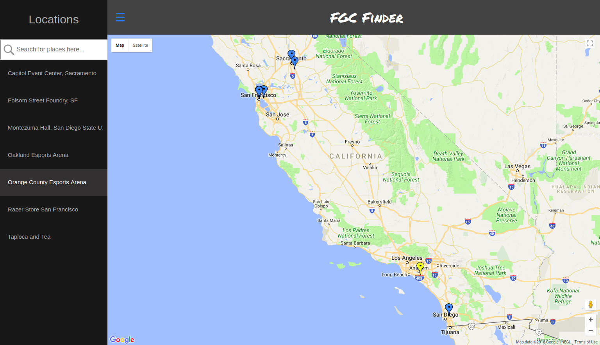
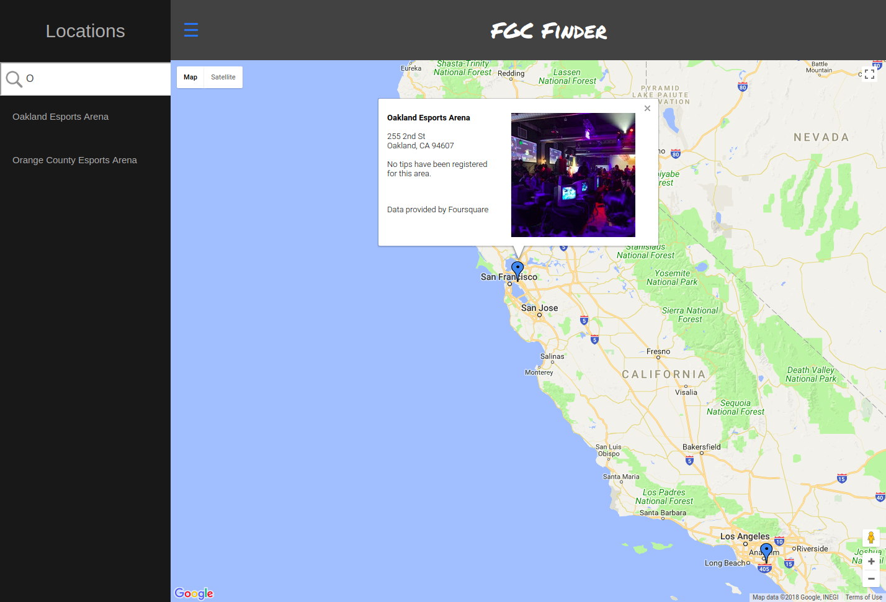
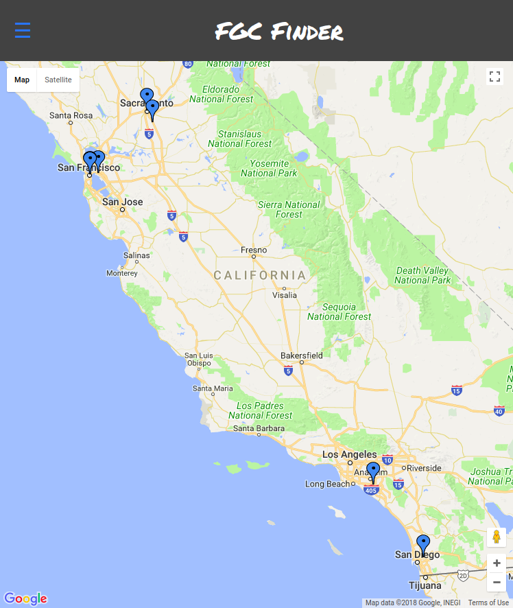

## Project Description
This application, developed as a project for Udacity's FullStack Developer Nanodegree, is a neighborhood map of California identifying areas that the fighting game community (Street Fighter, etc.) reguarly meets at to have fun. The inspiration to develop this comes from my own interest in fighting games, and the lack of any good central resource to find areas to play against other fighting game enthusiasts. Thus, this app will be a continuous work in-progress! When I find locations, and if the location has good API data from Foursquare, then I'll update the app with those locations. They aren't easy to find though, in my opinion. 

## Getting Started
To run the application, just go to https://topdreg.github.io/fgc-map/. Alternatively, clone the repository and run index.html on your local computer. 

## How It Works
The map displays markers representing regularly visited locations for fighting game enthusiasts. If the marker is clicked, an infowindow pops up showing some information about the place. Furthermore, the markers change color or bounce depending on whether the marker is hovered over or clicked.  

There is also a side navigation bar that the user can use to interact with the markers. If the user wishes to search for a place, there is a search query input field, which as more locations continue to be added should prove useful. The application is also responsive - the side navigation bar will retract or expand depending on the size of the screen, unless the hamburger-like icon was clicked.

## Technologies Used 
* HTML/CSS
* Flexbox
* Javascript
* JQuery/AJAX 
* Knockdown.js 
* Google Maps API
* Foursquare API

## Screenshots

A marker here is highlighted by hovering over its list item in the navigation bar.

Infowindow is displayed due to clicking on the marker directly. The infowindow could also be opened by clicking on an item in the navigation bar.

Sidebar is hidden here because the width of the screen is too small.
